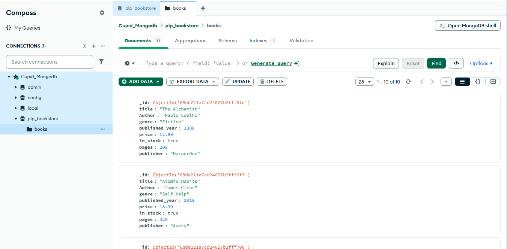
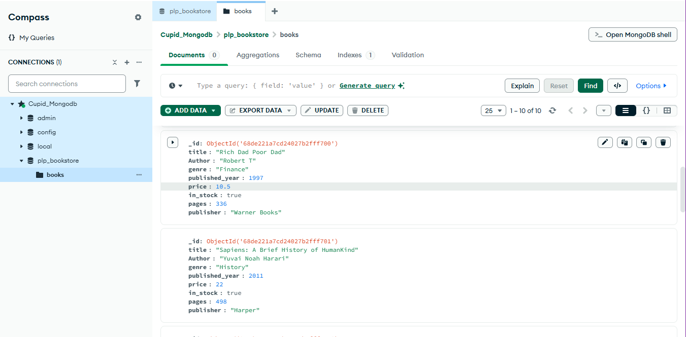

#  PLP Bookstore MongoDB Assignment

This project demonstrates basic and advanced MongoDB operations using a sample bookstore database.  
It is part of the PLP MongoDB coursework.

---

##  Project Structure
- **insert_books.js** → Inserts 10+ sample books into the `plp_bookstore` database (collection: `books`).  
- **queries.js** → Contains all queries:
  - Basic CRUD (Create, Read, Update, Delete)
  - Advanced queries with filtering, projection, sorting, pagination
  - Aggregation pipelines
  - Indexing examples  
- **README.md** → Instructions on how to set up and run the project.  
- **screenshot.png** → MongoDB Compass screenshot showing the `plp_bookstore` and sample data.  

---

##  Setup Instructions

### 1. Install MongoDB
- Install **MongoDB locally** (Community Edition)  
  OR  
- Set up a free **MongoDB Atlas cluster**.

### Inserted Data in MongoDB Compass

git clone <your-repo-url>
cd <your-repo-name>
